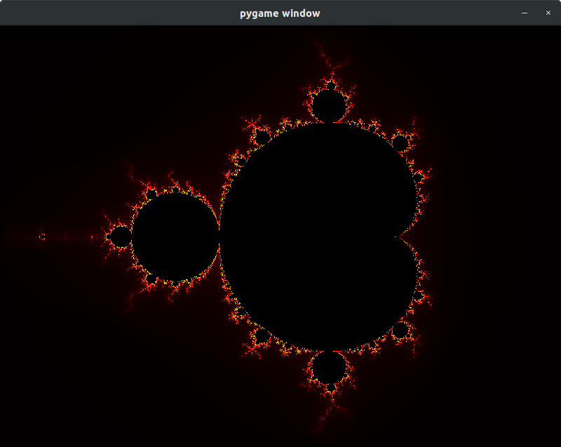
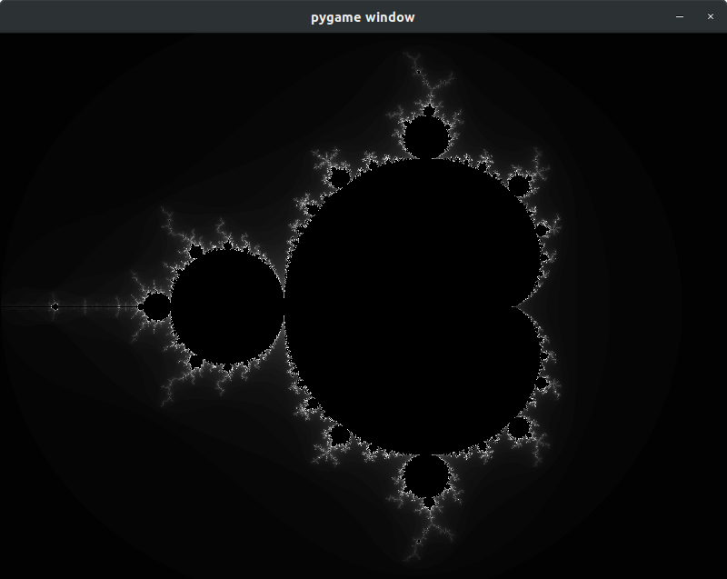
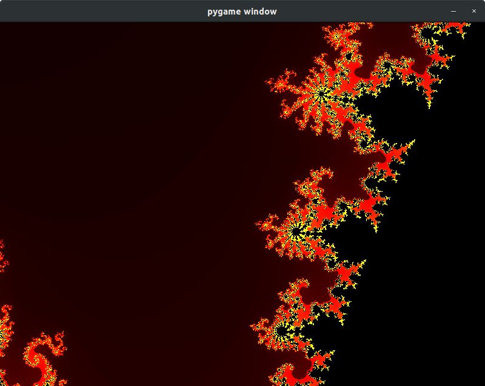
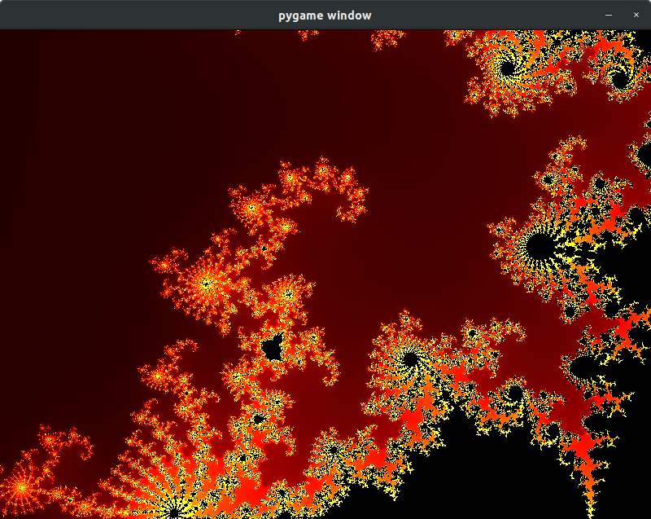
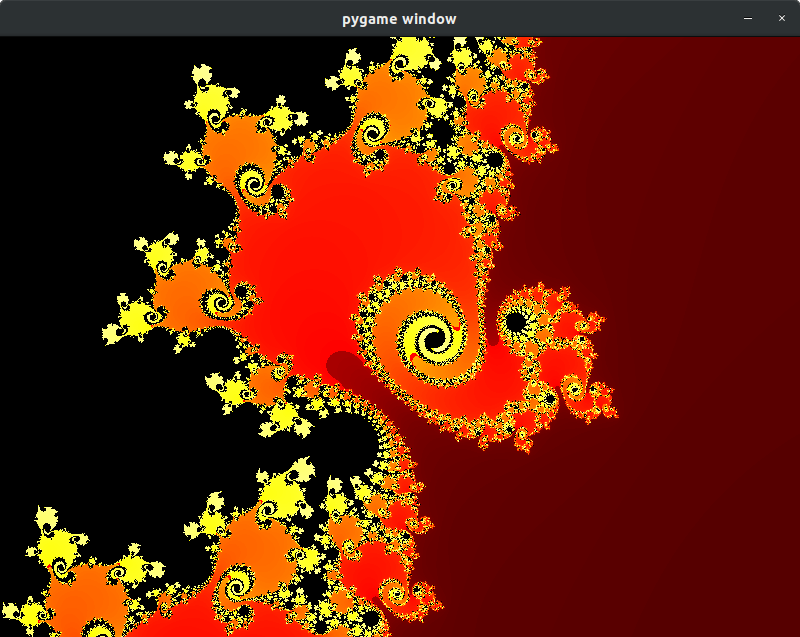

Hello.

I recently finally learned what the mandelbrot set is.
[This numberphile video](https://www.youtube.com/watch?v=FFftmWSzgmk) helped me a lot.

After watching this video I realized this would not be too hard to program.

So here is my rendition of the mandelbrot set.

I have attached some pictures from my exploration of this beautiful thing.

I would highly recommend others to explore it for themselves. It's super fun.

